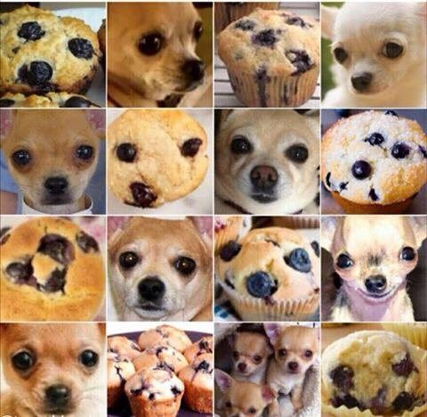
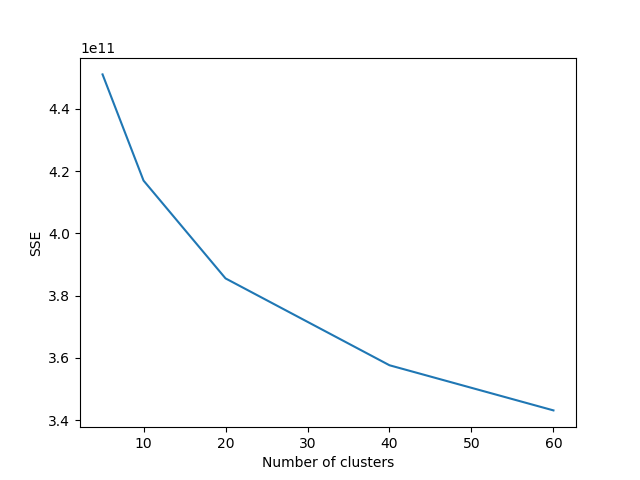

# Image Classification - Dogs vs Muffins vs Fried Chicken

This project classifies images of Dogs vs Muffins vs Fried Chicken, using methods of SIFT features, Bag of Words, K-means clustering, and SVM. 




## Project Steps
1. Download images from google-images
2. Get all training data SIFT descriptors
3. Bag of Words - Use K-means clustering to calculate codebook (vocabulary), choose K-means cluster size by elbow method
4. Assign each descriptor of each image to closest cluster center to get the codewords, calculate the histogram of the codewords as image features.
5. Apply linear SVM on features and labels, tune SVM hyper parameters

## Download Images
* download_images.py
  
Use the module from this [repo](https://github.com/ultralytics/google-images-download) to download 
images of poodles, blueberry muffins and fried chicken from google images.

## SIFT Features
SIFT, or Scale Invariant Feature Transform, is a feature detection algorithm in Computer Vision. SIFT helps locate the local features in an image, commonly known as the "keypoints" of the image. These keypoints are **scale & rotation** invariant that can be used for various computer vision applications, like image matching, object detection, scene detection, etc. We can also use the keypoints generated using SIFT as features for the image during model training. The major advantage of SIFT features, over edge features or hog features, is that they are not affected by the size or orientation of the image.
* Gaussian Blurring technique - reduce the noise in an image

**SIFT with CV2**  
Returns keypoints and descriptors, the size of descriptors is num_of_keypoints * 128.
```
import cv2
sift = cv2.xfeatures2d.SIFT_create()
kp, des = sift.detectAndCompute(img, None)
```

## Bag of Words
In computer vision, the bag-of-words model (BoW model) sometimes called bag-of-visual-words model can be applied to image classification, by treating image features as words. In document classification, a bag of words is a sparse vector of occurrence counts of words; that is, a sparse histogram over the vocabulary. In computer vision, a bag of visual words is a vector of occurrence counts of a vocabulary of local image features.
* From previous stpe, each image is represented by several descriptors of size k * 128.
* Run K-means clustering on all SIFT descriptors to produce a "codebook"(analogy to a word dictionary). Use elbow method to get most reasonable cluster size.
* Code words are defined as the center of the clusters. The number of the clusters is the codebook size. Codebook dataframe is of size C * 128, C is the cluster size.
* Each descriptor of the image is mapped to a certain codeword, and the image can be represented by the histogram of the codewords.



## SVM
* Apply SVM on on image features dataframe calculated from last step
* Tune SVM hyper parameters "C"

## Results

## References 
* [*A Detailed Guide to the Powerful SIFT Technique for Image Matching (with Python code)*](https://www.analyticsvidhya.com/blog/2019/10/detailed-guide-powerful-sift-technique-image-matching-python/)
* [*Bag-of-words model in computer vision*](https://en.wikipedia.org/wiki/Bag-of-words_model_in_computer_vision)